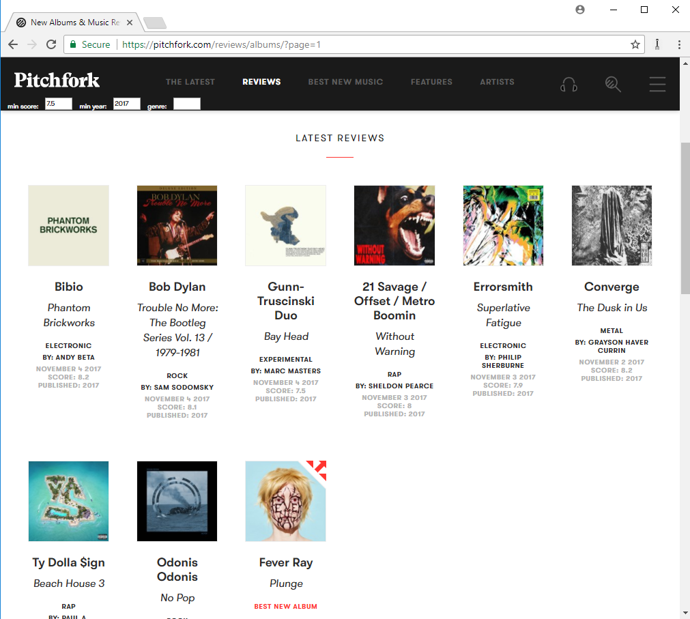

Trident [](https://travis-ci.org/jmbeach/trident)
==============

Chrome extension which provides enhancements for the music review website [Pitchfork.com](https://pitchfork.com)

# Features

- Load YouTube video for currently viewed album review
    + Gets the video by scraping the page for the furthest scrolled review
      available.
        + Can be refreshed by clicking extension icon
    + 
- Filter the Pitchfork review list by score, published year, and genre
    + Also displays score and year published on the page, which is not
      default behavior of Pitchfork.
    + 

# Dependencies

- NodeJS
- TypeScript

# Build

To build:

1. Clone the repository
2. Run `npm install`
3. Run `npm run-script build` or `npm run-script watch`

The project requires that you specify a YouTube API key. To do so, create
a file with contents like the following under `src/config/config.json`

```js
{
    "youtubeApiKey": "<your-youtube-api-key>"
}
```

You can get a YouTube API key [here](https://console.developers.google.com/apis/dashboard).

# Run

To use Trident, open the Chrome extensions menu and click *Load unpacked
extension* and select the `dist` directory of this repo.

# Project Structure Notes

The main project files which are intended to be edited exist in the `src`
directory. These are the TypeScript files which
[WebPack](https://webpack.js.org/) will output into the `dist` directory.
Files with the `.js` files are chrome-extension specific files and are copied to `dist`
explicitly.

The images which are actually displayed as part of the chrome extension
are contained in there as well.

# Roadmap

- YouTube video loading
    + Display list of videos for search query
    + Use Spotify to get entire album if available and is user preference
    + Make loading more user-interactive as right now it doesn't request and
      it's not intuitive that it loads the furthest scrolled review.
        + For example, if you scroll back up the page, it should offer
          a prompt to let you switch songs.
    + Need a user-interactive way to hide the YouTube videos
- Filtering
    + Filtering currently uses a timer and determines if necessary to show
      or hide items if new items have appeared after scrolling.
        + Needs to change to only happen if more reviews appear on the
          page or if the custom UI input changes.
- Better Icon Art
    + Currently just have an icon of a pitchfork. Want a cool trident.
    + No icon for the large image yet.